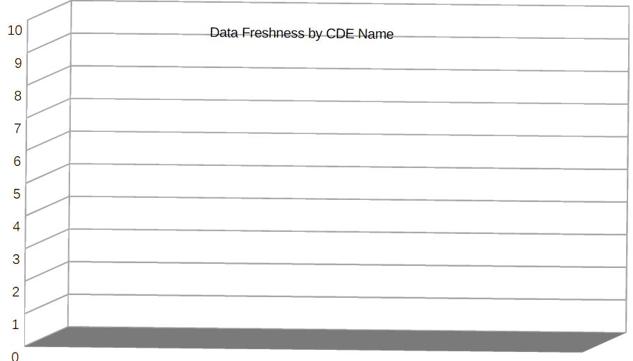

<p align="center">
  
  
  
  
</p>

<h1 align="center">🩺 CDE Health Monitor</h1>
<p align="center">📊 Data Discrepancy & Freshness Dashboard using Python</p>

# 🩺 CDE Health Monitor — Data Quality & Freshness Dashboa



## 📘 Overview
The **CDE Health Monitor** tracks and visualizes the *data quality, consistency, and freshness* of Customer Data Elements (CDEs).  
It detects missing, invalid, or outdated records and highlights data health trends across systems.

This project demonstrates strong **data analysis, visualization, and monitoring** capabilities using Python libraries.

---

## ⚙️ Tech Stack
| Category | Tools |
|-----------|-------|
| Language | Python 🐍 |
| Data Analysis | Pandas, NumPy |
| Visualization | Matplotlib, Seaborn |
| File Handling | OpenPyXL |
| Version Control | Git & GitHub |
| IDE | VS Code / Jupyter Notebook |

---

## 📊 Features
✅ Detects missing vs valid CDE values  
✅ Monitors record freshness trends  
✅ Generates clean data health visuals  
✅ Modular and scalable code structure  
✅ Easy deployment & automation-ready  

---

## 📂 Project Structure
CDE-Health-Monitor/
│
├── data/ # Input raw datasets
├── processed/ # Cleaned/processed output files
├── notebooks/ # Jupyter notebooks for exploration
├── src/ # Python scripts for data handling
├── Freshness_by_CDE.png # Visualization 1
├── Missing_vs_Valid.png # Visualization 2
├── requirements.txt # Dependencies
├── LICENSE # MIT License
└── README.md # Project overview
---
---

## 🧠 Insights
- **Data Quality Dashboard:** Helps business teams quickly see which data elements are stale or inconsistent.  
- **Visual Health Indicators:** Highlights freshness gaps and invalid-data ratios.  
- **Scalable Monitoring:** Can integrate into ETL pipelines or data warehouses.

---

## 🚀 How to Run
1. Clone the repository:
   ```bash
   git clone https://github.com/saiseggoju/CDE-Health-Monitor.git


