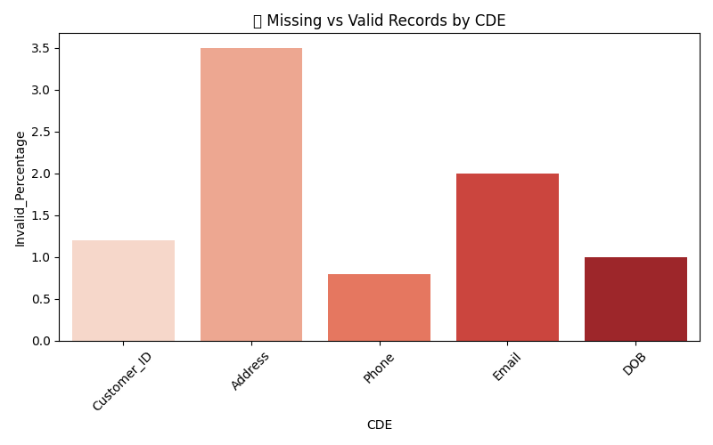

  
  
  
  

<h1 align="center">🩺 CDE Health Monitor – Data Discrepancy & Freshness Dashboard</h1>

📊 A Python-powered dashboard to analyze data freshness, consistency, and quality for Customer Data Elements (CDEs).

---
### 📘 Project Overview  
The **CDE Health Monitor** project tracks and visualizes **data quality, consistency, and freshness** across key *Customer Data Elements (CDEs)*.  
It automatically identifies **missing, invalid, or outdated** records to maintain reliable data pipelines and improve analytics performance.

---

## 🎯 Objectives  
- Detect missing or stale records  
- Measure invalid data percentages  
- Visualize CDE data quality and freshness  
- Support proactive monitoring for ETL workflows  

---

## 🧩 Tech Stack  

| Category | Tools Used |
|-----------|------------|
| **Programming Language** | Python 3 |
| **Libraries** | Pandas, Matplotlib, Seaborn, OpenPyXL |
| **File Storage** | Excel (.xlsx) |
| **Environment** | Jupyter Notebook / VS Code |

---

## ⚙️ Setup & Installation  

#### 1️⃣ Clone this Repository  
git clone https://github.com/saiseggoju/CDE-Health-Monitor.git
cd CDE-Health-Monitor

shell
Copy code

#### 2️⃣ Install Dependencies  
pip install -r requirements.txt

arduino
Copy code

If `requirements.txt` is not available, manually install:  
pip install pandas matplotlib seaborn openpyxl

bash
Copy code

#### 3️⃣ Run the Notebook  
jupyter notebook

yaml
Copy code

Then open **CDE_Health_Monitor.ipynb** and click **Run All Cells ▶️**

---

## 📊 Dashboard Outputs  

### 🗓️ Data Freshness by CDE  
This chart shows how recent the records are for each Customer Data Element (CDE).  
Lower “Freshness Days” indicate more up-to-date data.

+------------------+----------------+
| CDE | Freshness_Days |
+------------------+----------------+
| Customer_ID | 2 |
| Address | 5 |
| Phone | 1 |
| Email | 4 |
| DOB | 3 |
+------------------+----------------+

yaml
Copy code

**📈 Chart Preview:**  

---

### ❌ Missing vs Valid Records by CDE  
This visualization highlights the invalid or missing record percentages per CDE.

+------------------+--------------------+
| CDE | Invalid_Percentage |
+------------------+--------------------+
| Customer_ID | 1.2 |
| Address | 3.5 |
| Phone | 0.8 |
| Email | 2.0 |
| DOB | 1.0 |
+------------------+--------------------+

yaml
Copy code

**📊 Chart Preview:**  

---

## 📁 Output Files  

| File Name | Description |
|------------|-------------|
| `processed/CDE_Health_Report.xlsx` | Contains freshness metrics for all CDEs |
| `processed/discrepancy_report.xlsx` | Tracks invalid or missing data records |
| `Freshness_by_CDE.png` | Visualization of data freshness |
| `Missing_vs_Valid.png` | Visualization of data validity |

---

## 💡 Insights  
- Provides a **quick overview** of data freshness and validity  
- Detects data issues before they impact business reporting  
- Improves confidence in analytics through data health monitoring  

---

## 🚀 Future Enhancements  
- Integrate with **Snowflake / AWS S3 / Azure Blob** for real-time data monitoring  
- Automate daily freshness checks  
- Add **email or Slack alerts** for data quality breaches  

---

## 👩‍💻 Author  
**Seggoju Sai Sri Kavya**  
🎓 Master’s in Analytics | 💼 Data Analyst | 🧠 Python & SQL Enthusiast  

GitHub: [https://github.com/saiseggoju](https://github.com/saiseggoju)  
LinkedIn: [https://www.linkedin.com/in/sai-seggoju/](https://www.linkedin.com/in/sai-seggoju/)  

---

## 📄 License  
This project is licensed under the **MIT License**.  
You may freely use, modify, and share this project with proper credit.

---

🌸 *"Reliable data builds reliable insights."* 🌸  

